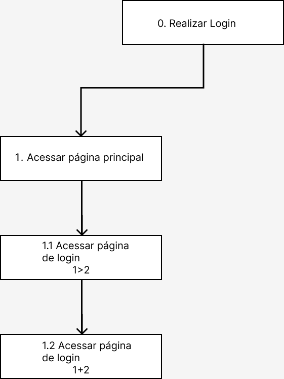
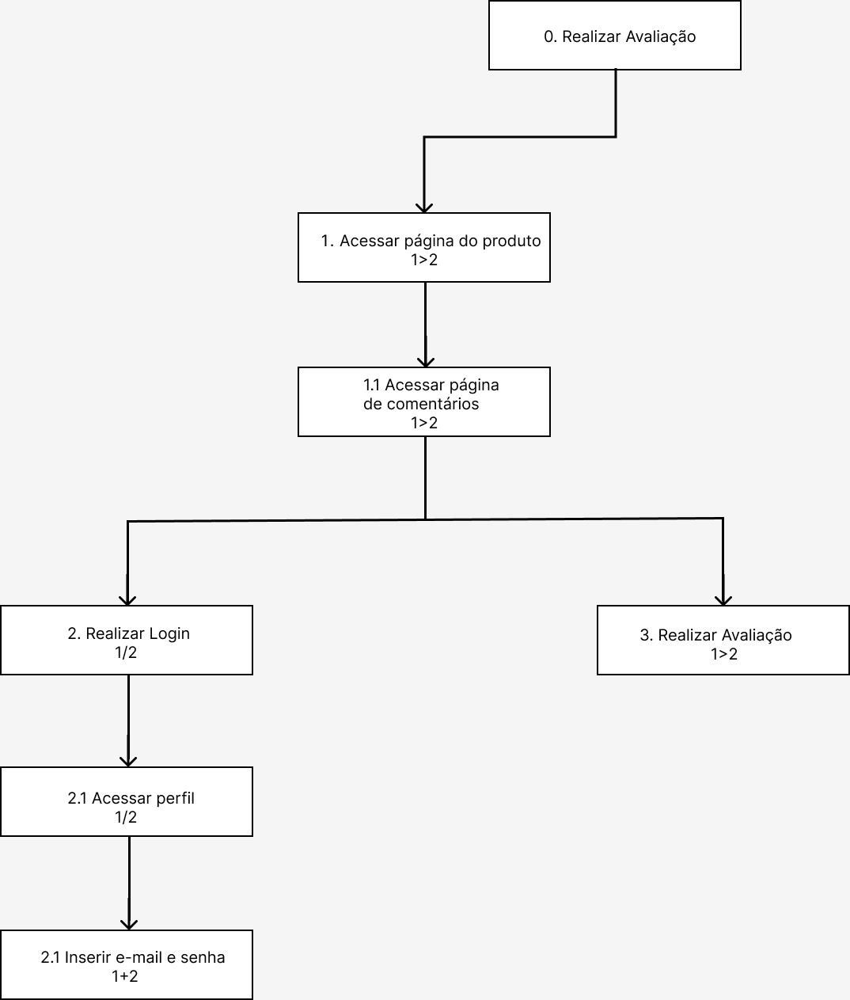
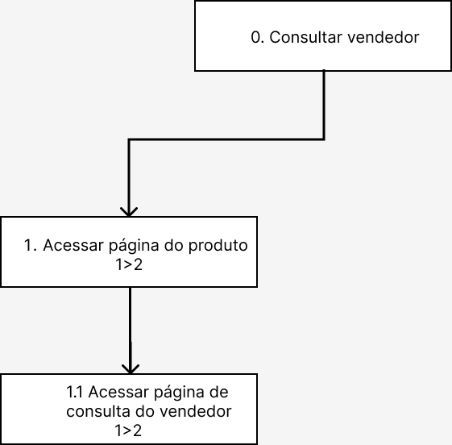
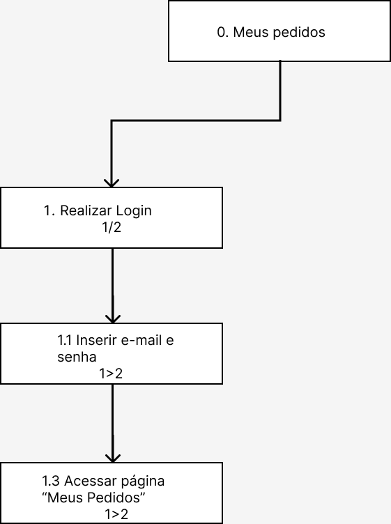

# Análise de Tarefas

## 1. Introdução

A análise de tarefas é usada para fins de uma melhor compreensão sobre os usuários na questão de qual é o trabalho dele, como é realizado e porque é realizado. O trabalho se baseia em objetivos que os usuários necessitam ou desejam fazer, assim sendo, abrange na representação dos métodos de classificação, coletas e interpretação de informações da evolução do empenho de um sistema que contém ao menos uma pessoa associada.

Um dos métodos mais comuns é a Análise Hierárquica de Tarefas, no qual foi a escolhida para o desenvolvimento do projeto. O motivo da escolha foi porque com esse método é identificado as barreiras presentes nas ações que os usuários enfrentam para atingirem seus objetivos e ajuda a encontrar problemas de desempenho no sistema.

## 2. Análise Hierárquica de Tarefas (AHT)

A análise Hierárquica de Tarefas é um método que tem como embasamento a psicologia funcional e não comportamental, entendendo as competências e habilidades evidenciadas nas tarefas de nível complexo, e consequentemente observando os objetivos dos usuários ao interagirem com um sistema. As tarefas são determinadas em uma decomposição hierárquica de objetivos e subobjetivos, portanto, a análise Hierárquica de Tarefas tem como início de partida as definições dos objetivos das pessoas e não pela a listagem de ações.

A definição das relações entre os subobjetivos é dada pelo plano que determina quais são os subobjetivos precisos para atingir um objetivo maior. Essas Relações são:

- **Em sequencial:** um objetivo só pode ser usado antes do próximo;
- **Em seleção/decisão:** Vai depender da situação para determinar qual objetivo será utilizado;
- **Em paralelo:** Independente da situação mais de um objetivo vai ser usado ao mesmo tempo.

A **Figura 1** é a legenda para o diagrama da Análise Hierárquica de Tarefas, nela são apresentados os dois tipos de elementos e os símbolos que representam cada forma de relação entre subobjetivos.

    

    **Figura 1: Legenda do diagrama AHT.**

    Fonte: BARBOSA (2021).

## 3. Diagrama

Para realizar a análise de tarefas, foi realizado uma pesquisa dentro do site da Millenium Papelaria e separado algumas atividades que é possível realizar dentro do mesmo. As seguintes tarefas foram retiradas para a análise:

- Realizar Cadastro
- Realizar Login
- Realizar Compras
- Comentar/Avaliar
- Consultar Vendedor
- Meus Pedidos
- Minha Conta

### 3.1 Realizar Cadastro

    

    **Figura 2: Diagrama AHT de cadastro de usuário.**

    Fonte: Elaboração Própria.

|       Objetivos / Operações       |                                                                                                                                                                                      Problemas e recomendações                                                                                                                                                                                       |
| :-------------------------------: | :--------------------------------------------------------------------------------------------------------------------------------------------------------------------------------------------------------------------------------------------------------------------------------------------------------------------------------------------------------------------------------------------------: |
|        0. Cadastrar conta         |                                                                                                                                                                                                                                                                                                                                                                                                      |
| 1. Acessar página de cadastro 1>2 |                                                                                                                                                   Input: Texto "cadastre-se" em vermelho Feedback: será redirecionado para a página de cadastro                                                                                                                                                   |
| 1.1 Inserir dados do usuário 1+2  | Input: Área intitulada "Informação Pessoal" Feedback: Após inserir os dados do usuário, será redirecionado para a página "Painel Geral" da conta  Problema: No cadastro é necessário inserir o CPF do usuário, porém ao analisar o site é percebido que não tem motivos para ser obrigatório o CPF no cadastro   Recomendações: Colocar o CPF como opcional, ou retirar a opção no cadastro |

> **Tabela 1: Tabela AHT de cadastro de usuário.** Fonte: Elaboração Própria.

### 3.2 Realizar Login

    

    **Figura 3: Diagrama AHT de login de usuário.**

    Fonte: Elaboração Própria.

|      Objetivos / Operações      |                                                                            Problemas e recomendações                                                                            |
| :-----------------------------: | :-----------------------------------------------------------------------------------------------------------------------------------------------------------------------------: |
|        0. Realizar Login        |                                                                                                                                                                                 |
| 1. Acessar página principal 1>2 |                                                                 Input: Página principal da Millenium Papelaria                                                                  |
| 1.1 Acessar página de Login 1>2 |                                       Input: "Entre" em vermelho Feedback: Será redirecionado para a página de "login ou cadastre-se"                                        |
| 1.2 Inserir e-mail e senha 1+2  | Input: Inserir dados de login nos campos "Endereço de e-mail" e "Senha" Feedback: Após inserir os dados do usuário, será redirecionado para a página "Painel Geral" da conta |

> **Tabela 2: Tabela AHT de login de usuário.** Fonte: Elaboração Própria.

### 3.3 Realizar Compras

    

    **Figura 4: Diagrama AHT de compras de produto.**

    Fonte: Elaboração Própria.

|      Objetivos / Operações      |                                                                                                                                                                                         Problemas e recomendações                                                                                                                                                                                         |
| :-----------------------------: | :-------------------------------------------------------------------------------------------------------------------------------------------------------------------------------------------------------------------------------------------------------------------------------------------------------------------------------------------------------------------------------------------------------: |
|       0. Realizar Compras       |                                                                                                                                                                                                                                                                                                                                                                                                           |
| 1. Acessar página principal 1>2 |                                                                                                                                                                              Input: Página principal da Millenium Papelaria                                                                                                                                                                               |
|     1.1 Buscar produto 1>2      |                             Input: Barra de pesquisa ou navegação por categoria Action: Inserir nome do produto na barra de pesquisa. Feedback: Será redirecionado para uma página com produtos da categoria ou nome utilizado na busca  Problema: Os produtos não possuem preço na página de busca  Recomendações: Mostrar preços dos produtos a serem vendidos.                             |
|   1.2 Selecionar produto 1>2    | Input: Produto que deseja consultar Feedback: Será redirecionado para a página do produto que foi selecionado.  Problema: O produto não possui preço, para consultar o preço do produto é necessário consultar o vendedor via Whatsapp, onde muitos dos links para a consulta estão quebrados.  Recomendações: Mostrar preço do produto em sua página sem a necessidade de consultar o vendedor. |
|     1.3 Comprar Produto 1+2     |                                                    Input: Botão verde "CONSULTE VENDEDOR" Feedback: Será encaminhado para outra página onde será redirecionado para uma conversa de Whatsapp com o vendedor.  Problemas: Links quebrados. Recomendações: Realizar modificações para que a venda seja feita pela própria página da papelaria.                                                     |

> **Tabela 3: Tabela AHT de compra de produtos.** Fonte: Elaboração Própria.

### 3.4 Comentar/Avaliar

    

    **Figura 5: Diagrama AHT de comentários de produto.**

    Fonte: Elaboração Própria.

|         Objetivos / Operações         |                                                                                                                                                                                 Problemas e recomendações                                                                                                                                                                                 |
| :-----------------------------------: | :---------------------------------------------------------------------------------------------------------------------------------------------------------------------------------------------------------------------------------------------------------------------------------------------------------------------------------------------------------------------------------------: |
|          0. Comentar/Avaliar          |                                                                                                                                                                                                                                                                                                                                                                                           |
|   1. Acessar página do produto 1>2    |                                                                                                                            Input: Produto que deseja consultar. Action: Selecionar algum produto. Feedback: Será redirecionado para a página do produto.                                                                                                                            |
| 1.1 Acessar página de comentários 1>2 |                                                                                                                           Input: Área intitulada "Comentários". Feedback: Será pedido para realizar cadastro ou realizar login para registrar o comentário.                                                                                                                            |
|         2. Realizar Login 1/2         |                                                                                                                                                                                                                                                                                                                                                                                           |
|        2.1 Acessar perfil 1/2         |                                                                                                                                            Input: Texto "identifique-se" em vermelho. Feedback: Será redirecionado para a página de login.                                                                                                                                             |
|    2.2 Inserir e-mail e senha 1+2     |                                                                                            Input: Inserir dados de login nos campos "Endereço de e-mail" e "Senha" Feedback: Após inserir os dados do usuário, será redirecionado para a página "Comentários" do produto selecionado antes                                                                                             |
|       3. Realizar avaliação 1>2       | Input: Inserir comentário, título e nome nos campos descritos. Feedback: Ao realizar um comentário, ele é enviado para aprovação. Problemas: Não é possível saber se o comentário realmente foi feito e aguarda aprovação ou se apenas foi perdido no limbo.  Recomendações: Deixar comentários aberto com alguns filtros de palavras impróprias e sem necessidade de aprovação. |

> **Tabela 4: Tabela AHT de avaliação de produto.** Fonte: Elaboração Própria.

### 3.5 Consultar vendedor

    

    **Figura 6: Diagrama AHT de consultar vendedor do produto.**

    Fonte: Elaboração Própria.

|             Objetivos / Operações              |                                                                                                                                                              Problemas e recomendações                                                                                                                                                              |
| :--------------------------------------------: | :-------------------------------------------------------------------------------------------------------------------------------------------------------------------------------------------------------------------------------------------------------------------------------------------------------------------------------------------------: |
|             0. Consultar vendedor              |                                                                                                                                                                                                                                                                                                                                                     |
|        1 Acessar página do produto 1>2         |                                                                                                                       Input: Selecionar produto a ser consultado.  Feedback: Será redirecionado para a página do produto.                                                                                                                        |
| 1.1 Acessar página de consulta do vendedor 1+2 | Input: Botão verde "CONSULTE VENDEDOR".  Feedback: Será encaminhado para outra página com uma conversa do Whatsapp do vendedor para iniciar uma conversa.  Problemas: Links quebrados.  Recomendações: Colocar informações, preço do produto, e realizar a venda do produto pela própria página sem a necessidade de consultar o vendedor. |

> **Tabela 5: Tabela AHT de consultar vendedor.** Fonte: Elaboração Própria.

### 3.6 Meus pedidos

    

    **Figura 7: Diagrama AHT dos pedidos realizados pelo usuário.**

    Fonte: Elaboração Própria.

|         Objetivos / Operações         |                                                                                                                     Problemas e recomendações                                                                                                                     |
| :-----------------------------------: | :---------------------------------------------------------------------------------------------------------------------------------------------------------------------------------------------------------------------------------------------------------------: |
|            0. Meus pedidos            |                                                                                                                                                                                                                                                                   |
|         1. Realizar Login 1/2         | Input: "Entre" em vermelho Feedback: Será redirecionado para a página de "login ou cadastre-se". Plano: Caso ja esteja utilizando sua conta clica no texto em vermelho escrito "Minha Conta" e depois na opção "Meus pedidos" no menu de navegação lateral. |
|    1.2 Inserir e-mail e senha 1/2     |                                          Input: Inserir dados de login nos campos "Endereço de e-mail" e "Senha" Feedback: Após inserir os dados do usuário, será redirecionado para a página "Painel Geral" da conta                                          |
| 1.3 Acessar página "Meus Pedidos" 1>2 |                                                       Input: Texto "Meus pedidos" na barra de navegação lateral. Feedback: Será redirecionado para a página com todos os pedidos já feito pelo usuário.                                                        |

> **Tabela 6: Tabela AHT de pedidos do usuário.** Fonte: Elaboração Própria.

### 3.7 Minha Conta

    

    **Figura 8: Diagrama AHT de "Minha Conta"
    Fonte: Elaboração Própria.

|     Objetivos / Operações      |                                                                                                     Problemas e recomendações                                                                                                     |
| :----------------------------: | :-------------------------------------------------------------------------------------------------------------------------------------------------------------------------------------------------------------------------------: |
|       0. Minha Conta 1>2       |                                                                                                                                                                                                                                   |
|     1. Realizar Login 1/2      | Input: "Entre" em vermelho Feedback: Será redirecionado para a página de "login ou cadastre-se".  Plano: Caso já esteja na conta e queira acessar o campo "Minha Conta", clicar no texto em vermelho escrito "Minha Conta". |
| 1.2 Inserir e-mail e senha 1+2 |                          Input: Inserir dados de login nos campos "Endereço de e-mail" e "Senha" Feedback: Após inserir os dados do usuário, será redirecionado para a página "Painel Geral" da conta                          |

> **Tabela 7: Tabela AHT de "Minha Conta".** Fonte: Elaboração Própria.

## 4. Histórico de versão

| Versão | Data  | Descrição                                               | Autor                             | Revisor          |
| ------ | ----- | ------------------------------------------------------- | --------------------------------- | ---------------- |
| 0.1    | 19/07 | Desenvolvimento inicial do documento análise de tarefas | Maria Eduarda B. e Bruno Oliveira |                  |
| 0.2    | 20/07 | Criação dos tópicos 1 e 2                               | Maria Eduarda B.                  |                  |
| 0.2    | 20/07 | Criação das tabelas e diagramas                         | Bruno Oliveira                    | Maria Eduarda B. |

## 5. Referências

> 2020.1-BCE. GitHub. Disponível em: https://interacao-humano-computador.github.io/2020.1-BCE/#/pages/ponto_de_controle_1/escolha_site?id=an%c3%a1lise-de-sites. Acesso em: 19 jul. 2022;

> 2020.2-Ingresso.eear. GitHub. Disponível em: https://interacao-humano-computador.github.io/2020.2-Ingresso.eear/analise-de-requisitos/analise-de-tarefas/. Acesso em: 19 jul. 2022.

> 2019.2-Wish. GitHub. Disponível em: https://interacao-humano-computador.github.io/2019.2-Wish/sprint01/analise/. Acesso em: 19 jul. 2022.

> Barbosa, S. D. J.; Silva, B. S. da; Silveira, M. S.; Gasparini, I.; Darin, T.; Barbosa, G. D. J. (2021) _Interação Humano-Computador e Experiência do usuário_. Autopublicação. ISBN: 978-65-00-19677-1.
