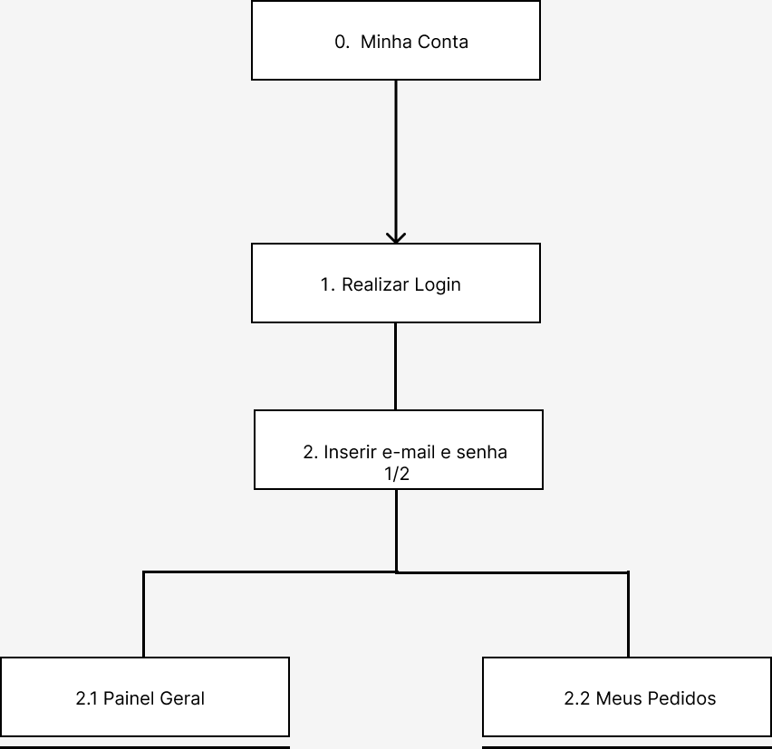

# Análise de Tarefas

## 1. Introdução

A análise de tarefas é usada para fins de uma melhor compreensão sobre os usuários na questão de qual é o trabalho dele, como é realizado e porque é realizado. O trabalho se baseia em objetivos que os usuários necessitam ou desejam fazer, assim sendo, abrange na representação dos métodos de classificação, coletas e interpretação de informações da evolução do empenho de um sistema que contém ao menos uma pessoa associada.

Um dos métodos mais comuns é a Análise Hierárquica de Tarefas, no qual foi a escolhida para o desenvolvimento do projeto. O motivo da escolha foi porque com esse método é identificado as barreiras presentes nas ações que os usuários enfrentam para atingirem seus objetivos e ajuda a encontrar problemas de desempenho no sistema.

## 2. Análise Hierárquica de Tarefas (AHT)

A análise Hierárquica de Tarefas é um método que tem como embasamento a psicologia funcional e não comportamental, entendendo as competências e habilidades evidenciadas nas tarefas de nível complexo, e consequentemente observando os objetivos dos usuários ao interagirem com um sistema. As tarefas são determinadas em uma decomposição hierárquica de objetivos e subobjetivos, portanto, a análise Hierárquica de Tarefas tem como início de partida as definições dos objetivos das pessoas e não pela a listagem de ações.

A definição das relações entre os subobjetivos é dada pelo plano que determina quais são os subobjetivos precisos para atingir um objetivo maior. Essas Relações são:

- **Em sequencial:** um objetivo só pode ser usado antes do próximo;
- **Em seleção/decisão:** Vai depender da situação para determinar qual objetivo será utilizado;
- **Em paralelo:** Independente da situação mais de um objetivo vai ser usado ao mesmo tempo.

A **Figura 1** é a legenda para o diagrama da Análise Hierárquica de Tarefas, nela são apresentados os dois tipos de elementos e os símbolos que representam cada forma de relação entre subobjetivos.

**Figura 1: Legenda do diagrama AHT.**

    Fonte: BARBOSA (2021).

## 3. Diagrama

Para realizar a análise de tarefas, foi realizado uma pesquisa dentro do site da Millenium Papelaria e separado algumas atividades que é possível realizar dentro do mesmo. As seguintes tarefas foram retiradas para a análise:

- Realizar Cadastro
  - Realizar Login
- Realizar Compras
  - Avaliar produto
  - Consultar vendedor
- Minha Conta
  - Meus pedidos

### 3.1 Realizar Cadastro / Login

    

    **Figura 2: Diagrama AHT de cadastro / login de usuário.**

    Fonte: Elaboração Própria.

|       Objetivos / Operações        |                                                                                                                                  Problemas e recomendações                                                                                                                                   |
| :--------------------------------: | :------------------------------------------------------------------------------------------------------------------------------------------------------------------------------------------------------------------------------------------------------------------------------------------: |
|         0. Cadastrar conta         |                                                                                                                                                                                                                                                                                              |
|  1. Acessar página principal 1/2   |                                                                                                                        Input: Página principal da Millenium Papelaria                                                                                                                        |
| 1.1 Acessar página de cadastro 1>2 |                                                                                         Input: Texto em vermelho escrito "cadastre-se". Feedback: Será redirecionado para página de cadastro.                                                                                          |
|        1.1.2 Inserir dados         | Input: Formulário de "Informações Pessoais". Problema: No cadastro é necessário inserir o CPF do usuário, porém ao analisar o site é percebido que não tem motivos para ser obrigatório o CPF no cadastro   Recomendações: Colocar o CPF como opcional, ou retirar a opção no cadastro |
|      1.2 Entrar na conta 1>2       |                                                                           Input: Texto em vermelho escrito "Entrar". Feedback: Será redirecionado para página com opção de entrar na conta ou cadastrar conta.                                                                            |
|    1.2.1 Inserir e-mail e senha    |                                                                                                 Input: Campos de e-mail e senha. Feedback: Será redirecionado para Painel Geral da conta.                                                                                                 |

> **Tabela 1: Tabela AHT de cadastro / login de usuário.** Fonte: Elaboração Própria.

### 3.2 Realizar Compras

    

    **Figura 3: Diagrama AHT de compras de produto.**

    Fonte: Elaboração Própria.

|      Objetivos / Operações      |                                                                                                                                                                                         Problemas e recomendações                                                                                                                                                                                         |
| :-----------------------------: | :-------------------------------------------------------------------------------------------------------------------------------------------------------------------------------------------------------------------------------------------------------------------------------------------------------------------------------------------------------------------------------------------------------: |
|       0. Realizar Compras       |                                                                                                                                                                                                                                                                                                                                                                                                           |
| 1. Acessar página principal 1/2 |                                                                                                                                                                              Input: Página principal da Millenium Papelaria                                                                                                                                                                               |
|       1.1 Buscar produto        |                             Input: Barra de pesquisa ou navegação por categoria Action: Inserir nome do produto na barra de pesquisa. Feedback: Será redirecionado para uma página com produtos da categoria ou nome utilizado na busca  Problema: Os produtos não possuem preço na página de busca  Recomendações: Mostrar preços dos produtos a serem vendidos.                             |
|  1.1.2 Selecionar produto 1/2   | Input: Produto que deseja consultar Feedback: Será redirecionado para a página do produto que foi selecionado.  Problema: O produto não possui preço, para consultar o preço do produto é necessário consultar o vendedor via Whatsapp, onde muitos dos links para a consulta estão quebrados.  Recomendações: Mostrar preço do produto em sua página sem a necessidade de consultar o vendedor. |
|     1.1.2.1 Comprar Produto     |                                                    Input: Botão verde "CONSULTE VENDEDOR". Feedback: Será encaminhado para outra página onde será redirecionado para uma conversa de Whatsapp com o vendedor.  Problemas: Links quebrados. Recomendações: Realizar modificações para que a venda seja feita pela própria página da papelaria.                                                    |
|     1.1.2.2 Avaliar Produto     |         Input: Inserir comentário, título e nome nos campos descritos. Feedback: Ao realizar um comentário, ele é enviado para aprovação. Problemas: Não é possível saber se o comentário realmente foi feito e aguarda aprovação ou se apenas foi perdido no limbo.  Recomendações: Deixar comentários aberto com alguns filtros de palavras impróprias e sem necessidade de aprovação.         |
|      1.2.1 Comprar Produto      |                                                                           Input: Botão verde "CONSULTE-NOS". Feedback: Será redirecionado para uma conversa do Whatsapp com o vendedor. Problemas Links quebrados. Recomendações: Realizar modificações para que a venda seja feita pela própria página da papelaria.                                                                            |

> **Tabela 2: Tabela AHT de compra de produtos.** Fonte: Elaboração Própria.

### 3.3 Minha Conta

    

    **Figura 4: Diagrama AHT de "Minha Conta"
    Fonte: Elaboração Própria.

|     Objetivos / Operações     |                                                                                                     Problemas e recomendações                                                                                                     |
| :---------------------------: | :-------------------------------------------------------------------------------------------------------------------------------------------------------------------------------------------------------------------------------: |
|        0. Minha Conta         |                                                                                                                                                                                                                                   |
|       1. Realizar Login       | Input: "Entre" em vermelho Feedback: Será redirecionado para a página de "login ou cadastre-se".  Plano: Caso já esteja na conta e queira acessar o campo "Minha Conta", clicar no texto em vermelho escrito "Minha Conta". |
| 2. Inserir e-mail e senha 1/2 |                          Input: Inserir dados de login nos campos "Endereço de e-mail" e "Senha" Feedback: Após inserir os dados do usuário, será redirecionado para a página "Painel Geral" da conta                          |
|       2.1 Painel Geral        |                                                                                        Input: Página com informações gerais da conta.                                                                                          |
|       2.2 Meus Pedidos        |                                             Input: Área intitulada "Meus pedidos" no menu de navageação lateral.  Feedback: Será redirecionado para página com pedidos do usuário.                                             |

> **Tabela 3: Tabela AHT de "Minha Conta".** Fonte: Elaboração Própria.

## 4. Histórico de versão

| Versão | Data  | Descrição                                               | Autor                             | Revisor          |
| ------ | ----- | ------------------------------------------------------- | --------------------------------- | ---------------- |
| 0.1    | 19/07 | Desenvolvimento inicial do documento análise de tarefas | Maria Eduarda B. e Bruno Oliveira |                  |
| 0.2    | 20/07 | Criação dos tópicos 1 e 2                               | Maria Eduarda B.                  |                  |
| 0.2    | 20/07 | Criação das tabelas e diagramas                         | Bruno Oliveira                    | Maria Eduarda B. |

## 5. Referências

> 2020.1-BCE. GitHub. Disponível em: https://interacao-humano-computador.github.io/2020.1-BCE/#/pages/ponto_de_controle_1/escolha_site?id=an%c3%a1lise-de-sites. Acesso em: 19 jul. 2022;

> 2020.2-Ingresso.eear. GitHub. Disponível em: https://interacao-humano-computador.github.io/2020.2-Ingresso.eear/analise-de-requisitos/analise-de-tarefas/. Acesso em: 19 jul. 2022.

> 2019.2-Wish. GitHub. Disponível em: https://interacao-humano-computador.github.io/2019.2-Wish/sprint01/analise/. Acesso em: 19 jul. 2022.

> Barbosa, S. D. J.; Silva, B. S. da; Silveira, M. S.; Gasparini, I.; Darin, T.; Barbosa, G. D. J. (2021) _Interação Humano-Computador e Experiência do usuário_. Autopublicação. ISBN: 978-65-00-19677-1.
