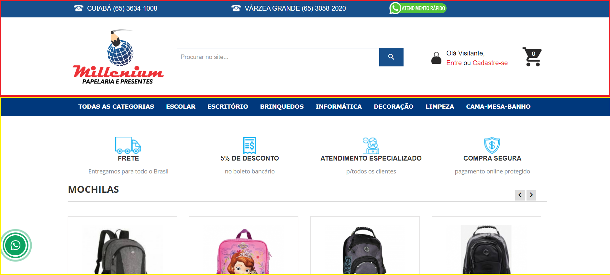
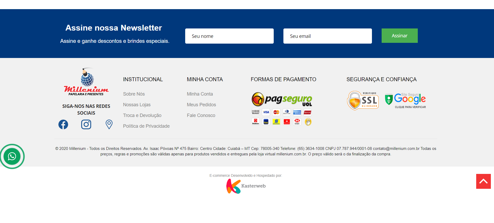
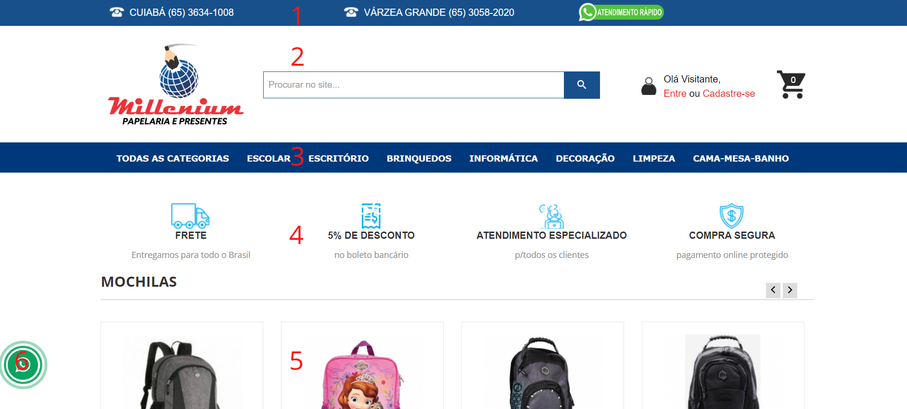
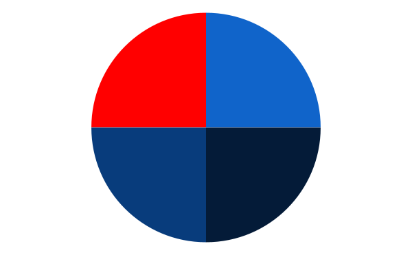
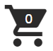
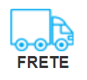

# Guia de Estilo

## 1. Introdução

Guia de estilo é um documento indicado para projetos de grande porte, definindo padrões a serem seguidos ao longo do seu desenvolvimento para que  possam ser seguidos e não esquecidos e que sirva para devida interação entre a equipe mantendo com a devida noção do que será feito. São incluidos quaisquer informações que agreguem valor no conteúdo a ser criado.

## 2. Objetivos
Neste guia de estilo o intuito é apresentar a identidade visual do site da loja Millenium Papelaria. Identificar padrões seguidos pela loja, apesar de não haver um padrâo pré ordenado como há para sites públicos.

## 3. Análise

### Disposição espacial e grid

A tela geral do site é dividida em três partes principais. 
Superior marcada em vermelho na figura 1, contendo o Menu de informações fixas que não são alteradas independente da ação realizada pelo usuário e inferior destacado em amarelo, seguindo de acordo com as intenções realizadas pelo usuário. Já na figura 2 podemos ver o rodapé da tela contendo informações de contato

Figura 1 - Tela inicial Millenium Papelaria com divisões

 Fonte - site Millenium Papelaria 

Figura 2 - Rodapé Millenium Papelaria

 Fonte - site Millenium Papelaria 

### Elementos

A duas áreas principais são compostas pelos seguintes elementos numerados na figura 2:

1. Menu principal de comunicação e informações
2. Logo da papelaria, barra de pesquisa, login/cadastro 
3. Categorias dos produtos
4. Detalhes de uma possível compra
5. Produtos de uma categoria escolhida pelo usuário
6. Botão de contato para whatsApp
   

Figura 3 - Elementos principais Millenium Papelaria

 Fonte - site Millenium Papelaria 

### Tipografia

Para a composição dos textos presentes foram usadas diferentes fontes, inseridas com intuito de harmonizar o design de acordo com a melhor colocação em cada espaço.

sans-serif, Open Sans, Helvetica Neue, Helvetica, Arial

Apesar das 5 variações de fonte todas foram pensadas para formar o melhor design possível.

### Cores

As cores principais escolhidas para o site são vermelho(#ff0000) e três tons de azul(#083c7c, #041b38, #1064ca) apresentadas na figura 3 que são as cores principais apesar do fundo branco e dos detalhes em preto. O vermelho escolhido é uma cor que causa excitação e chama a atenção do cliente, já o azul passa segurança dois aspectos que grande importancia para cativar um usuário que possa querer fazer compras em um site de artigos de papelarias. 

Figura 4 - Paleta de cores

 Fonte - Autoria própria 

## Icones

| ID | Icone | Descrição | 
| :------: | :----------: | :-------------:| 
| 1  | | O icone é um carrinho aparece no topo direito da tela é um link de acesso ao carrinho de compras  |
| 2  | | O icone é um boneco aparece no topo direito da tela ao lado do link de login e cadastro | 
| 3  | | O icone é um caminhão aparece no centro a esquerda da tela com informações sobre o frete| 
| 4  | | O icone é um  cifrão aparece no centro da tela indicando informações de desconto| 
| 5  | | O icone é uma mulher aparece no centro da tela indicando informações sobre o atendimento fornecido| 
| 6  | | O icone é um brasão aparece no centro a direita com informações de confiabilidade na compra|
| 7  | | O icone é um carro aparece na parte inferior da tela com informações sobre o estacionamento nas lojas presenciais| 
| 8  | | O icone do instagram/facebook aparecem no fim da página indicando as redes sociais da loja| 
| 9  | | O icone é um telefone aparece no topo da tela na lateral esquerda e no centro indicando os numeros telefonicos da loja| 
| 10 | | O icone é do whatsApp aparece na lateral direita flutuante na tela indicando um link para whatsApp da loja| 

## 4. Referências

> Barbosa, S. D. J.; Silva, B. S. da; Silveira, M. S.; Gasparini, I.; Darin, T.; Barbosa, G. D. J. (2021)
Interação Humano-Computador e Experiência do usuário. Autopublicação. ISBN: 978-65-00-19677-1.

## 5. Histórico de versão

| Versão | Data       | Descrição             | Autor           | Revisor |
| ------ | ---------- | --------------------- | ------------    |---------|
|   0.1  | 30/07/2022 | Criação do documento  | Ingrid Carvalho |  |