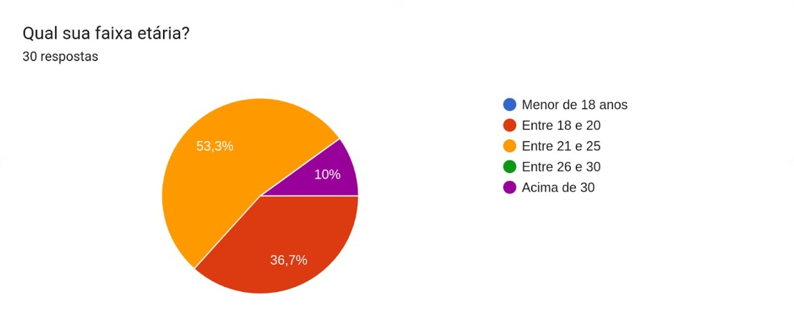
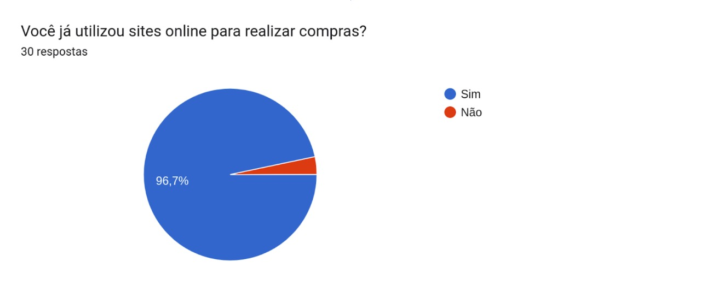
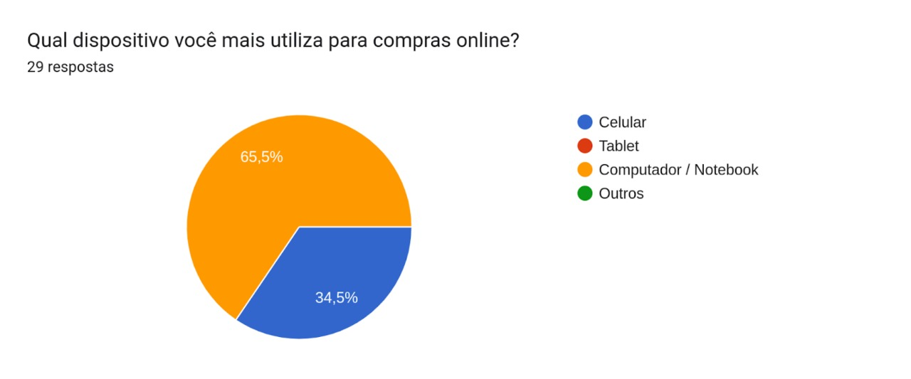
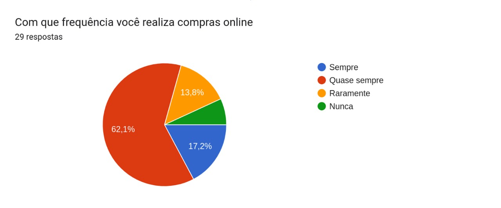
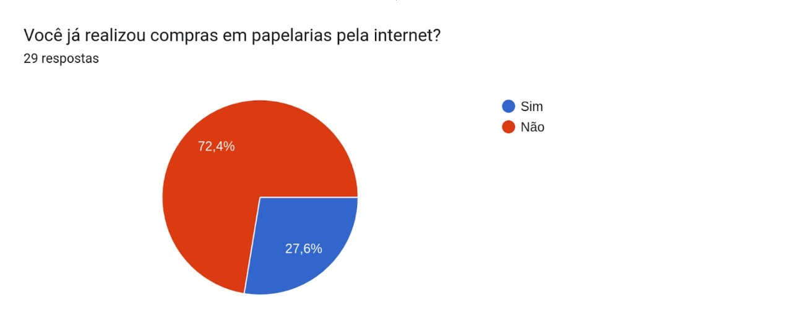
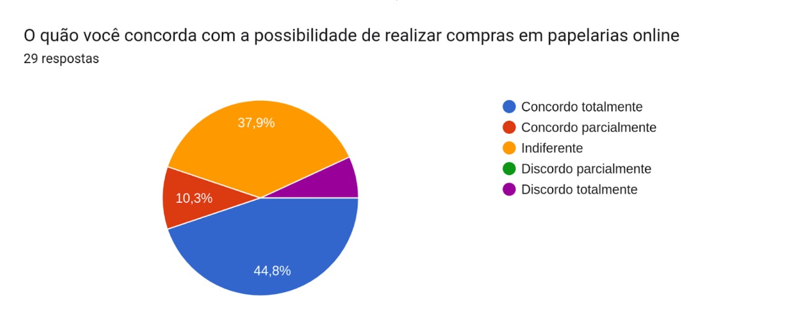

# Perfil de Usuário

## 1. Introdução

A análise do perfil de usuário do sistema visa descobrir e definir quais as características das pessoas que utilizam/utilizarão o sistema que está sendo desenvolvido. Essa etapa é de extrema importância para poder melhorar a experiencia de quem acessa o software de acordo com o seus traços em comum. Para obter esses dados foi realizada uma pesquisa através de um questionário

## 2. Metodologia

Foi desenvolvido um questionário contendo 6 perguntas a respeito de quem é o usuário e a experiência deles com compras onlines no geral e sobre compras em papelarias virtualmente, o questionário se inicializou perguntando sobre idade e se já foi realizada compras online, após isso é perguntado sobre como o usuário faz essas compras e com que frequencia, depois é questionado sobre a experiência e uso com compras em sites de papelarias.

## 3. Resultados Obtidos

O questionário obteve 30 respostas e ficou disponível do período de 18/07/2022 até 20/07/2022.

Em relação às perguntas temos que na primeira pergunta (***1 - Qual sua faixa etaria***), temos suas respostas na representação gráfica presente na ***Figura 1***. A partir do questionário notamos que cerca de metade da amostra tem entre 18 a 20 anos e nenhum dos participantes é menor de idade.

**Figura 1: Gráfico de respostas para faixa etária**

Agora sobre a segunda pergunta (***2 - Você já utilizou sites online para realizar compras?***), temos suas respostas na representação gráfica presente na ***Figura 2***. Assim observamos que somente um dos participantes nunca utilizou sites online para realizar compras, com isso vemos a importância e necessidade de sites onlines na realização de compras.

**Figura 2: Gráfico de respostas para utilização de sites online para compras**

Na terceira pergunta (***3 - Qual dispositivo você mais utiliza para compras online?***), temos suas respostas na representação gráfica presente na ***Figura 3***. Podemos observar a utilização de somente dois tipos de dispositivos distintos utilizados para realizar compras online (celular e computador/notebook), onde o uso de computador/notebook é praticamente o dobro da quantidade de usos de celulares.

**Figura 3: Gráfico de respostas para qual dispositivo utilizado para compras online**

Já na quarta pergunta (***4 - Com que frequência você realiza compras online?***), temos suas respostas na representação gráfica presente na ***Figura 4***. Aqui observamos que a frequência de compras online pelos participantes do formulário é bem frequente, onde cerca de 80% dos participantes realiza compras online (*sempre ou quase sempre*).

**Figura 4: Gráfico de respostas para qual a frequência de compras online**

Na quinta pergunta temos (***5 - Você já realizou compras em papelarias pela internet?***), temos suas respostas na representação gráfica presente na ***Figura 5***. Com essas respostas observamos que a quantidade de usuários que realizaram compras em papelarias online são baixas, somente 27,6% dos usuários já realizaram esse tipo de compra.

**Figura 5: Gráfico de respostas para compras em papelarias pela internet**

Agora na sexta e última pergunta (***6 - O quão você concorda com a possibilidade de realizar compras em papelarias online?***), temos suas respostas na representação gráfica presente na ***Figura 6***. Nesta parte podemos observar que grande parte dos usuários (55,1%) concordam total ou parcialmente com a possibilidade de realizar compras em papelarias online. Porém é importante também salientar que existe uma taxa de 37,9% dos usuários que são indiferentes a essa possibilidade, o que pode demonstrar um certo desinteresse nesse setor. Já em questão de discordar totalmente da possibilidade temos uma pequena faixa de somente 6,9% dos usuários.

**Figura 6: Gráfico de respostas para a possibilidade de compras em papelarias online**

## 4. Conclusão

Levando em conta os dados levantados a partir do formulário em relação a amostra obtida, podemos concluir que o nosso perfil de usuário se baseia principalmente em pessoas da faixa etária dos 18 aos 25 anos, onde praticamente todos já tiveram experiências com a realização de compras online e são em sua grande maioria compradores frequentes. Porém apesar disso apenas uma pequena parte já teve experiências de compras online especificamente em papelarias, onde a partir disso seria necessário entender o motivo dessa falta de compras no setor de papelarias.

Apesar do motivo ainda não ser encontrado de forma clara, podemos concluir também com o formulário que apesar da baixa de compras online neste setor, é um setor onde somente uma baixíssima porcentagem dos usuários discordam da possibilidade de realizar compras em papelarias online, mas mesmo assim mantendo este mesmo foco, temos uma taxa grande de usuários que vêm a compra online em papelarias de forma indiferente, sendo assim tal ponto deve ser levado em consideração e analizar mais profundamente para que possa entender o que está desengajando estes usuários.

## 5. Histórico de Versão

| Versão    | Data | Descrição                 | Autor         | Revisor                        |
|-----------|------|---------------------------|---------------|--------------------------------|
| 0.1       |18/07 | Criação da página         | Arthur        | Ingrid e Maria Eduarda Marques |
| 0.2       |20/07 | Finalização da página     | Gian          | Ingrid e Maria Eduarda Marques |
