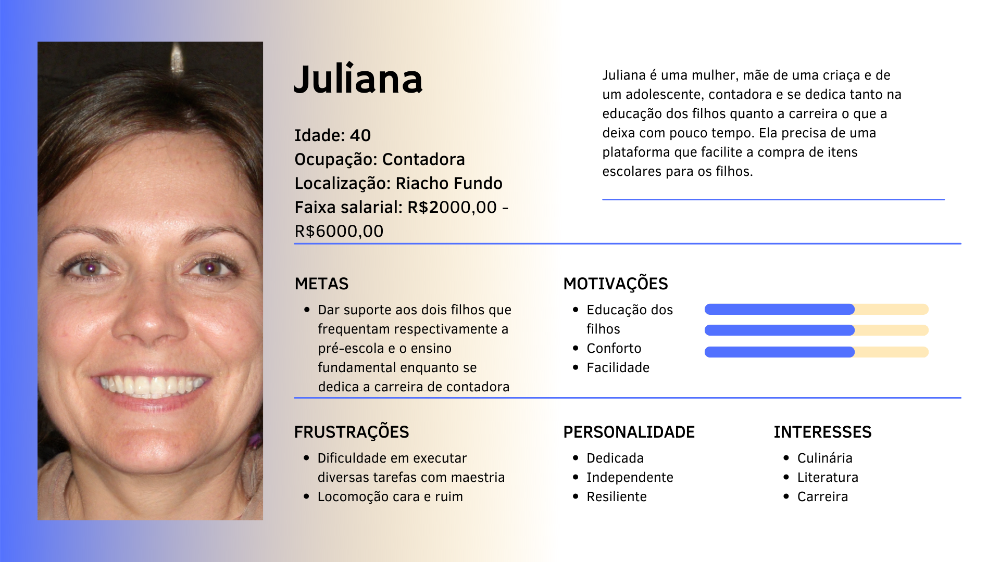
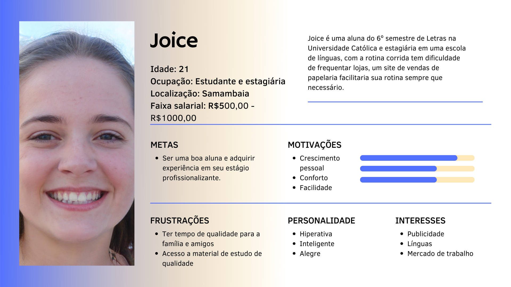
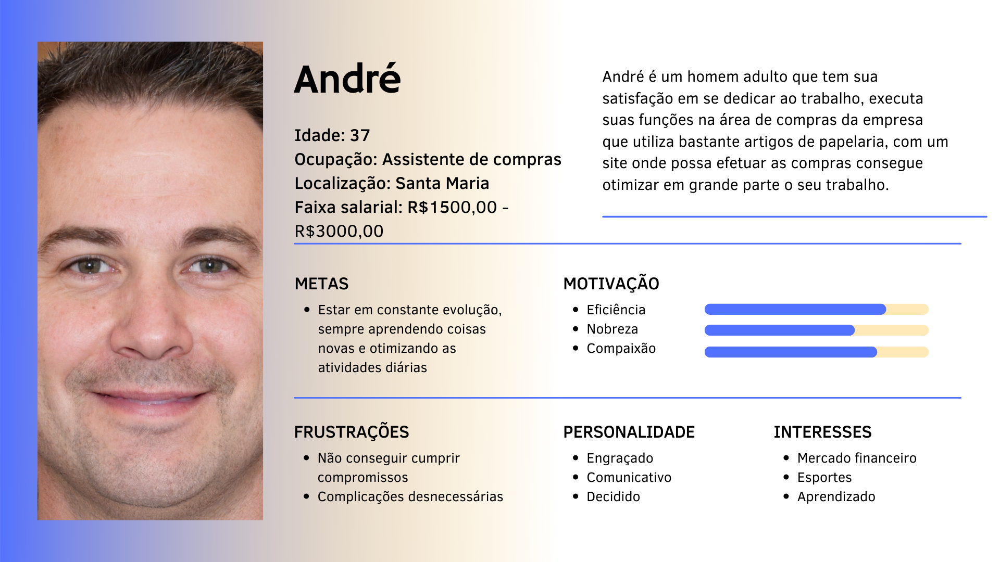
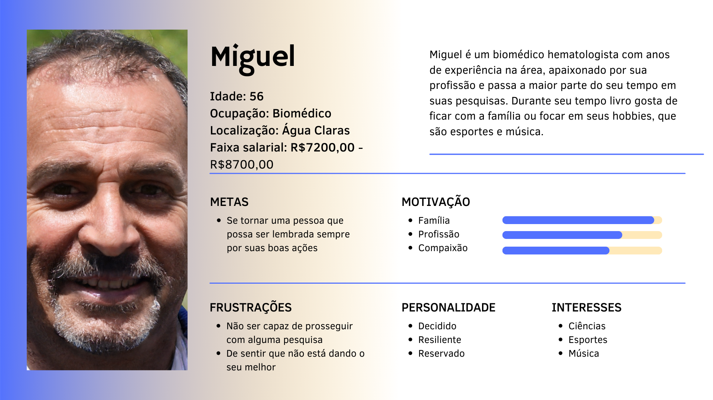

# Personas 

## 1. Introdução 

Uma persona é um personagem fictício, arquétipo hipotético de um grupo de usuários reais,
criada para descrever um usuário típico (Cooper et al., 2014; Pruitt e Adlin, 2006; Cooper, 1999).

Courage e Baxter (2005) vão apontar o cuidado na hora da escolha do número de personas, pois é importante que as personas sejam memoráveis e, para isso, o elenco de personas deve ser reduzido. Dessa forma, com base na sugestão desses dois autores, onde eles sugerem que devemos criar pelo menos uma persona por papel de usuário e que o projeto possua três a 12 personas distintas, resolvemos que para o nosso projeto serão 3 personas primárias e uma antipersona.

## 2. Persona Primária

A persona primária nada mais é do que o indivíduo que será o
foco principal do design.

E seguindo a recomendação de que o elenco de personas deve incluir três personas primárias, abaixo nas figuras 1,2 e 3 mostraremos as peronas criadas e suas características.

## 2.1 Persona Primária 1

**Figura 1: Persona primária 1 e suas características**

    Fonte: Autoria própria

## 2.2 Persona Primária 2

**Figura 2: Persona primária 2 e suas características**

    Fonte: Autoria própria

## 2.3 Persona Primária 3

**Figura 3: Persona primária 3 e suas características**

    Fonte: Autoria própria

## 3. Antipersona

A antipersona é um personagem feito para demonstrar que o sistema não é projetado para elas.

Abaixo na figura 1 mostramos a nossa antipersona e suas devidas características.

**Figura 1: Antipersona e suas características**

    Fonte: Autoria própria

## 4. Histórico de versão

| Versão | Data       | Descrição             | Autor           | Revisor |
| ------ | ---------- | --------------------- | ------------    |---------|
| 0.1   | 19/07/2022 | Criação do documento  | Maria Eduarda M. | Maria Eduarda B. e Bruno |
| 0.2  | 19/07/2022 | Criação das personas e antipersona e adicionando o restante das informações do documento  | Maria Eduarda M. e Ingrid | Maria Eduarda B. e Bruno |

## 5. Referências

> Barbosa, S. D. J.; Silva, B. S. da; Silveira, M. S.; Gasparini, I.; Darin, T.; Barbosa, G. D. J. (2021) *Interação Humano-Computador e Experiência do usuário*. Autopublicação. ISBN: 978-65-00-19677-1.

> 2021.2-PMBA. GitHub. Disponível em: https://interacao-humano-computador.github.io/2021.2-PMBA. Acesso em: 20 de julho de 2022.

>2021.2-PrefeituraMunicipalItabuna. GitHub. Disponível em: https://interacao-humano-computador.github.io/2021.2-PrefeituraMunicipalItabuna/#/. Acesso em: 20 de julho de 2022.

 