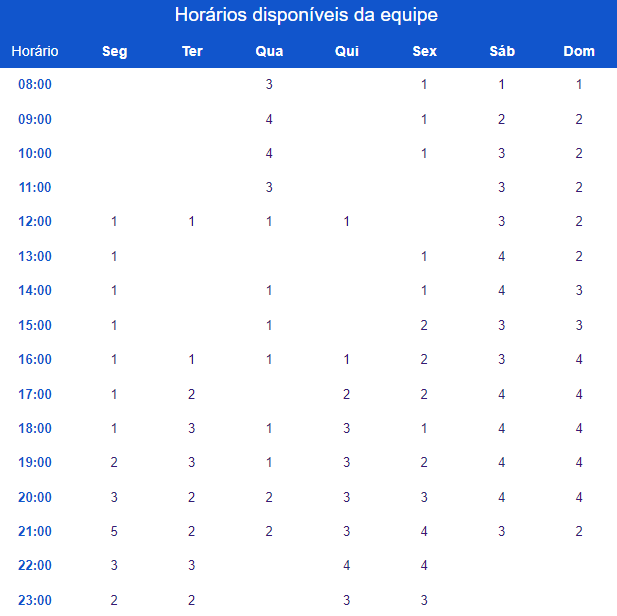

# Sobre as Reuniões

## 1. Introdução

Nossas reuniões serão ministradas na plataformas do teams e do discord,serão reuniões para organizações de tarefas e gravações de apresentações da disciplina. Elas serão realizadas nas segundas a partir das 21h, logo após o início de um ponto de controle.

## 2. Disponibilidade dos Integrantes 

Para decidirmos o melhor horário de reuniões foi feito uma planilha (Figura 1) na ferramenta do google "[Planilhas Google](https://docs.google.com/spreadsheets/d/1A4q_Jb_ozoCNdBTl0wpBPf6cTzWlvqTAGVMpYUAoils/edit?usp=sharing), nela foi feita uma votação para verificarmos a disponibilidade dos integrantes do grupo.

**Figura 1:** Planilha com a disponibilidade dos integrantes.

## 3. Histórico de versões

| Versão | Data       | Descrição             | Autor           | Revisor |
| ------ | ---------- | --------------------- | ------------    |---------|
| 1.0    | 10/07/2022 | Criação do documento  | Maria Eduarda M. | Maria Eduarda B. |

## 4. Referências 

>2021.1-Detran-DF. GitHub. Disponível em: https://interacao-humano-computador.github.io/2021.1-Detran-DF/. Acesso em: 9 de julho de 2022.

>2021.2-PMBA. GitHub. Disponível em: https://interacao-humano-computador.github.io/2021.2-PMBA. Acesso em: 10 de julho de 2022.

