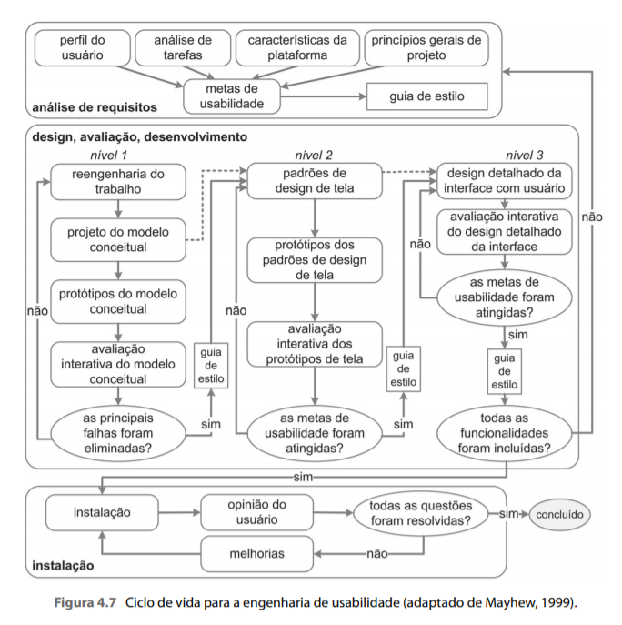

# Processo de Design

## 1. Introdução

Processo de design consiste em três atividades básicas:

* Análise da situação atual.
* Síntese de uma intervenção.
* Avaliação da nova situação.

Essas atividades buscam detalhar de forma diferente e define como executar cada tarefa, a ordem de execução, os artefatos necessários para que sejam realizadas e as produções. Uma característica comum entre os processos é a execução das atividades de forma **iterativa**, permitindo refinamentos sucessivos da análise da situação atual e da proposta de invervenção. (Barbosa e Silva, 2010).

## 2. Metodologia escolhida

Após a analise desse processo e de outros sugeridos durante as aulas, foi escolhido para realização do processo a proposta realizada por Deborah Mayhew, sendo ele o mais eficiente para as necessidades do projeto.

Essa proposta reune e organiza 3 diferentes atividades para orientar o trabalho do designer em direçao a uma boa solução interativa:

* **Análise de requisitos**: São definidas as metas de usabilidade com base no perfil dos usuários, análise de tarefas, possibilidade e limitações da plataforma do sistema dentre outros princípios de IHC.
  
* **Design, avaliação e desenvolvimento**: Busca encontrar uma solução de IHC que atenda às metas de usabilidade estabelecidas na fase anterior.

* **Instalação**: Nessa fase o designer deve coletar opiniões dos usuários após um tempo de uso a respeito do sistema. As opiniões deverão ser úteis para melhorar o sistema em versões futuras ou até mesmo para encontrar necessidades de desenvolver novos sistemas interativos ainda não previstos.

Na figura 1 é mostrado as três fases desse processo interativo.

*Figura 1: Engenharia de Usabilidade de Mayhew*.

## 3. Conclusão
Após a análise de alguns modelos, o ciclo de vida da Mayhew foi escolhido por ser a abordagem que mais se adequava aos objetivos do projeto da equipe. Nosso objetivo era criar um projeto completo, e Mayhew se encaixava perfeitamente. Com a execução deste projeto, espera-se que haja um bom aprendizado e desenvolvimento do conhecimento de IHC.

## 4. Histórico de Versão

| Versão    | Data | Descrição                 | Autor         | Revisor |
|-----------|------|---------------------------|---------------|---------|
| 0.1       |10/07 | Criação da página         | Arthur        | Bruno   |

## 5. Referências

>Barbosa, S. D. J.; Silva, B. S. da; Silveira, M. S.; Gasparini, I.; Darin, T.; Barbosa, G. D. J. (2021) Interação Humano-Computador e Experiência do usuário. Autopublicação. ISBN: 978-65-00-19677-1.
