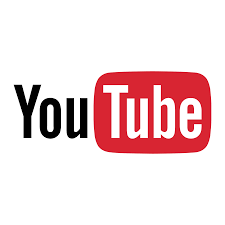

# Ferramentas ultilizadas

## 1. Introdução
Neste documento estão apresentados as plataformas que estão sendo ou que serão ultilizadas no auxilio da criação e edição do presente trabalho seja para a existencia ou apresentação das tarefas realizadas pela equipe.

| Logo | Ferramenta | Finalidade | 
| :------: | :----------: | :-------------:| 
|  | Teams | Reuniões e gravação das apresentações|
|  | Discord | Reuniões da equipe para organização das tarefas |
|  | Github | Hospedagem do repositório do projeto |
|  | Canva | Criação dos slides para as apresentações |
|  | Youtube | Plataforma para postagens dos vídeos das apresentações |
|  | Visual Studio Code | Edição dos artefatos em .md |

## 2. Histórico de versão

| Versão | Data       | Descrição                                           | Autor        |
| ------ | ---------- | --------------------------------------------------- | ------------ |
| 0.1    | 07/07/2022 | Criação do documento | Ingrid Carvalho |

